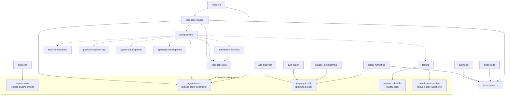

<div align="center">

# Claude Code Daodan

**38 specialized plugins that augment Claude Code into a specialized toolkit - so you spend less time prompting and more time shipping.**

> The Daodan is the symbiote that enhances its host. This marketplace is the Daodan of Claude Code.

[](LICENSE)
[](https://github.com/acaprino/claude-code-daodan/actions/workflows/consistency.yml)
[](.claude-plugin/marketplace.json)
[](#plugins)
[](#plugins)
[](#plugins)
[](#plugins)

</div>

---

## Why Claude Code Daodan?

- **Domain experts, not generic prompts** - each plugin encodes months of specialized knowledge (Python, Rust, React, security, SEO, legal...)
- **Multi-agent orchestration** - code review fires architecture, security, and pattern analysis in parallel
- **End-to-end workflows** - chain analysis, implementation, review, and cleanup into single commands
- **Install only what you need** - every plugin is independent, no runtime dependencies
- **Community-driven** - MIT licensed, upstream-synced with projects from Anthropic, Vercel, and others

## Quick Start

```bash
# Add the marketplace
claude plugin marketplace add acaprino/claude-code-daodan

# Install the plugins you need
claude plugin install python-development@claude-code-daodan
claude plugin install senior-review@claude-code-daodan
claude plugin install react-development@claude-code-daodan
```

That's it. Plugins activate automatically when relevant - or invoke them directly:

```bash
# Slash commands
/code-review          # Multi-agent architecture + security + pattern review
/senior-review:team-review  # Run a full multi-reviewer code review
/python-scaffold      # Scaffold a production-ready Python project

# Agents
"Use the python-engineer agent to implement rate limiting"
"Ask the rust-engineer to review my Tauri backend"
```

### Required dependencies

`ai-tooling` declares [obra/superpowers](https://github.com/obra/superpowers) as a hard dependency, marketplace-qualified since v12.0.2 (`dependencies: ["superpowers@claude-plugins-official"]` in `marketplace.json`): its planning phase loads the `brainstorming`, `writing-plans`, and `executing-plans` skills. If you install it, install superpowers too — from the official Claude plugin marketplace, which is the one the dependency resolves against:

```bash
claude plugin install superpowers@claude-plugins-official
```

Installing the same plugin from [obra's own marketplace](https://github.com/obra/superpowers-marketplace) (`superpowers@superpowers-marketplace`) does NOT satisfy the qualified dependency: the CLI reports it as missing and keeps the official copy pinned. Same bytes, wrong marketplace — use the official one, and don't keep both installed (the duplicate collides at load time).

More detail in [Brainstorming, planning, and execution](#brainstorming-planning-and-execution).

`app-analyzer`, `pwa-expert`, `digital-marketing`, and `grabber-development` declare [lackeyjb/playwright-skill](https://github.com/lackeyjb/playwright-skill) as a hard dependency (`dependencies: ["playwright-skill"]`): their browser-based workflows (web app exploration, live PWA audits, live SEO/GA4 checks, scraping discovery) run on its Playwright automation skill. Install it from its own marketplace:

```bash
claude plugin marketplace add lackeyjb/playwright-skill
claude plugin install playwright-skill@playwright-skill
```

More detail in [Browser automation (Playwright)](#browser-automation-playwright).

`testing` declares two hard dependencies since marketplace 18.0.0: [mattpocock/skills](https://github.com/mattpocock/skills) (`mattpocock-skills@mattpocock`, the `tdd` knowledge base) and [wshobson/agents](https://github.com/wshobson/agents) (`developer-essentials@claude-code-workflows`, the `e2e-testing-patterns` knowledge base). Without both installed the plugin does not load at all, so its `/testing:test-audit` and `/testing:test-consolidate` commands silently never appear:

```bash
claude plugin marketplace add mattpocock/skills
claude plugin install mattpocock-skills@mattpocock
claude plugin marketplace add wshobson/agents
claude plugin install developer-essentials@claude-code-workflows
```

More detail in [Test authoring knowledge bases (TDD and browser E2E)](#test-authoring-knowledge-bases-tdd-and-browser-e2e).

---

## Plugins

| Plugin | Description | A | S | C |
|--------|-------------|:-:|:-:|:-:|
| **[python-development](docs/plugins/python-development.md)** | TDD, refactoring, async patterns, packaging, performance, dead code, Pydantic v2, /python-audit | 3 | 9 | 3 |
| **[senior-review](docs/plugins/senior-review.md)** | 8 agents review architecture, security, patterns, distributed flows, logic integrity, API contracts, startup cycles, UI races, and codebase hygiene in parallel | 8 | 2 | 3 |
| **[codebase-mapper](docs/plugins/codebase-mapper.md)** | Generate 10 narrative docs with Mermaid diagrams from any codebase | 10 | 1 | 5 |
| **[ai-tooling](docs/plugins/ai-tooling.md)** | Prompt engineering and optimization, Agent SDK | 1 | 1 | 1 |
| **[tauri-development](docs/plugins/tauri-development.md)** | Tauri 2 desktop + mobile, Rust backend, IPC optimization | 3 | 1 | - |
| **[digital-marketing](docs/plugins/digital-marketing.md)** | SEO + AEO (AI Overviews/Perplexity/ChatGPT Search), GA4/GTM with Consent Mode v2, content strategy, brand naming, domain hunting | 4 | 4 | 6 |
| **[react-development](docs/plugins/react-development.md)** | React 19 performance, state management, bundle optimization | 1 | 1 | 1 |
| **[rag-development](docs/plugins/rag-development.md)** | RAG system design - chunking, embeddings, vector DBs, advanced patterns | 2 | 1 | 1 |
| **[marketplace-ops](docs/plugins/marketplace-ops.md)** | Audit, scaffold, review, and manage plugins in this ecosystem | 1 | 2 | 4 |
| **[learning](docs/plugins/learning.md)** | Mind maps in MarkMind format and interactive force-graphs | - | 3 | 1 |
| **[codebase-xray](docs/plugins/codebase-xray.md)** | 7-phase systematic codebase X-ray with pattern detection and concurrent runs, plus the interconnect mapper that review and documentation both build on (was deep-dive-analysis) | 5 | 1 | 2 |
| **[business](docs/plugins/business.md)** | Tech law, compliance, privacy docs, contracts, SaaS business planning | 3 | 1 | - |
| **[stripe](docs/plugins/stripe.md)** | Stripe payments, subscriptions, Connect, revenue optimization, /audit-webhooks | 3 | 1 | 1 |
| **[research](docs/plugins/research.md)** | Quick search and deep multi-source investigation with shared web-search techniques skill | 2 | 1 | 1 |
| **[project-setup](docs/plugins/project-setup.md)** | Create and maintain CLAUDE.md with ground truth verification | 1 | - | 2 |
| **[clean-code](docs/plugins/clean-code.md)** | Rewrite code for readability without changing behavior | 1 | - | 1 |
| **[app-analyzer](docs/plugins/app-analyzer.md)** | Analyze Android apps via ADB and webapps via Playwright | 1 | - | - |
| **[xterm](docs/plugins/xterm.md)** | Build and debug xterm.js terminal emulators | - | 1 | 2 |
| **[obsidian-development](docs/plugins/obsidian-development.md)** | Pass ObsidianReviewBot on first try | - | 3 | - |
| **[typescript-development](docs/plugins/typescript-development.md)** | TypeScript engineer agent, best practices, Knip dead code detection, and enterprise TypeScript mastery. Includes a type-safety review layer (type-safety-auditor agent, 20-rule skill, /review-typescript command) that also powers the ts-safety dimension of /senior-review:team-review. | 2 | 4 | 1 |
| **[system-utils](docs/plugins/system-utils.md)** | Clean up messy folders, find duplicates | - | 1 | 1 |
| **[messaging](docs/plugins/messaging.md)** | RabbitMQ queue design and AMQP patterns | 1 | - | - |
| **[csp](docs/plugins/csp.md)** | Scheduling, routing, assignment with OR-Tools CP-SAT | 1 | - | - |
| **[browser-extensions](docs/plugins/browser-extensions.md)** | Firefox extensions with Manifest V2/V3, /firefox-scaffold /firefox-lint /firefox-publish | 1 | 1 | 3 |
| **[docs](docs/plugins/docs.md)** | Craft top-tier README.md files | - | 1 | 1 |
| **[testing](docs/plugins/testing.md)** | Test-suite hygiene: search-before-write rules, whole-suite audit with quarantine, per-module consolidation, behavior-driven test generation | 2 | 1 | 2 |
| **[platform-engineering](docs/plugins/platform-engineering.md)** | Cross-platform security (passkeys/WebAuthn, Electron Fuses), architecture, and performance rulebook + /platform-review | 1 | 1 | 1 |
| **[ibkr-trading](docs/plugins/ibkr-trading.md)** | Interactive Brokers algotrading - TWS API, ib_async, order execution | 1 | 1 | 1 |
| **[mt5-trading](docs/plugins/mt5-trading.md)** | MetaTrader 5 Python algotrading - API, polling events, order execution | 1 | 1 | 1 |
| **[opentelemetry](docs/plugins/opentelemetry.md)** | OpenTelemetry Python - distributed tracing, context propagation, exporters, /otel-audit | 1 | 1 | 1 |
| **[docker](docs/plugins/docker.md)** | Optimized multi-stage Dockerfiles for any language or framework | - | 1 | - |
| **[grabber-development](docs/plugins/grabber-development.md)** | Python web scraping - coordinator + 3 specialists (stealth browser, HTTP fingerprint, AI scraping), anti-bot bypass | 4 | 1 | - |
| **[codebase-cleanup](docs/plugins/codebase-cleanup.md)** | Multi-language dependency security audits, SOLID refactoring, prioritized tech-debt roadmaps | - | - | 3 |
| **[libgdx-development](docs/plugins/libgdx-development.md)** | libGDX cross-platform game dev - rendering pipeline, Scene2D + Ashley ECS, Box2D, AssetManager, deploy to Desktop/Android/iOS/HTML5, /libgdx-audit | 1 | 1 | 1 |
| **[kotlin-development](docs/plugins/kotlin-development.md)** | Idiomatic Kotlin - coroutines, Flow/StateFlow, Kotlin Multiplatform (KMP), Jetpack Compose, Ktor server, type-safe DSLs | - | 1 | - |
| **[pwa-expert](docs/plugins/pwa-expert.md)** | Progressive Web Apps 2025-2026: manifest, service workers, Web Push, install flows, store distribution | 1 | 1 | 3 |
| **[abstraction-architect](docs/plugins/abstraction-architect.md)** | Pure-architecture audits: missed unification, wrong abstractions, diff-anchored prior-art search | 1 | 1 | 1 |
| **[text-humanizer](docs/plugins/text-humanizer.md)** | Remove AI writing traces from any prose (24 patterns) with /humanize-text; consumed by digital-marketing, codebase-mapper, business, clean-code | 1 | 1 | 1 |

**A** = Agents, **S** = Skills, **C** = Commands

### Dependency graph

Solid arrows are hard dependencies (`dependencies` in `marketplace.json`: the plugin does not work without them). Dashed arrows are optional dependencies (`optionalDependencies`: used when installed, skipped gracefully otherwise). Plugins with no declared dependencies and no dependents are omitted. External upstream plugins are grouped at the bottom with their marketplace name.



Solid arrows are hard dependencies, dotted ones optional. The hard graph is a tree rooted at `codebase-xray`, the plugin that works out how a codebase actually behaves: `senior-review` (review), `codebase-mapper` (documentation), and `abstraction-architect` all build on top of it, and it depends on nothing of ours. That shape is deliberate as of marketplace 16.0.0, when the shared interconnect mapper moved into `codebase-xray` and removed the last near-cycle. `senior-review`'s six optional edges back its conditional review dimensions, each skipped with a note when the plugin is absent rather than failing the review (the `testing` edge degrades differently: its dimension falls back to the generic reviewer instead of skipping). `text-humanizer` is a pure leaf: zero dependencies, four dependents.

### Frontend and design

This marketplace deliberately ships no general frontend/design plugin. That ground is covered better by the upstream projects it used to vendor from, so go straight to the source:

| Upstream | License | Covers |
|----------|---------|--------|
| [pbakaus/impeccable](https://github.com/pbakaus/impeccable) | Apache-2.0 | Design craft: typography, color and contrast, motion, cognitive load, delight, iOS/Android platform patterns |
| [nextlevelbuilder/ui-ux-pro-max-skill](https://github.com/nextlevelbuilder/ui-ux-pro-max-skill) | MIT | Design-system deliverables: token architecture, component specs, states and variants, Tailwind integration |
| [paulirish/dotfiles](https://github.com/paulirish/dotfiles/tree/main/agents/skills/modern-css) | MIT | Modern CSS reference. Not a marketplace: copy the skill folder by hand |

The first two install as marketplaces:

```bash
claude plugin marketplace add pbakaus/impeccable
claude plugin marketplace add nextlevelbuilder/ui-ux-pro-max-skill
```

Framework-specific frontend work stays here: [react-development](docs/plugins/react-development.md) for React 19 performance, [pwa-expert](docs/plugins/pwa-expert.md) for Progressive Web Apps, [browser-extensions](docs/plugins/browser-extensions.md) for Firefox add-ons, and [xterm](docs/plugins/xterm.md) for terminal UIs.

### Brainstorming, planning, and execution

Same story for the design-first workflow. The `brainstorming`, `writing-plans`, and `executing-plans` skills shipped in `ai-tooling` were ports of [obra/superpowers](https://github.com/obra/superpowers), which maintains them upstream inside a much larger methodology. Carrying three stale copies stopped paying for itself, so they are gone as of ai-tooling 3.0.0. As of marketplace 8.2.0, superpowers is no longer an optional companion: `ai-tooling` declares it as a hard dependency in `marketplace.json` — qualified as `superpowers@claude-plugins-official` since v12.0.2 — so install it from there alongside this marketplace.

| Upstream | License | Covers |
|----------|---------|--------|
| [obra/superpowers](https://github.com/obra/superpowers) | MIT | Design-first development: brainstorming a spec you actually sign off on, bite-sized implementation plans, subagent-driven execution, TDD, systematic debugging, worktree workflows |

Superpowers is listed on the [official Claude plugin marketplace](https://claude.com/plugins/superpowers), and the qualified dependency only resolves against that copy:

```bash
claude plugin install superpowers@claude-plugins-official
```

Obra's own [Superpowers marketplace](https://github.com/obra/superpowers-marketplace) carries the same plugin plus a few companions (e.g. `double-shot-latte`); adding that marketplace for the companions is fine, but install superpowers itself from `claude-plugins-official` only — a second copy from another marketplace doesn't satisfy the dependency and collides at load time.

Upstream also documents installs for Antigravity, Codex, Cursor, Gemini CLI, Copilot CLI, Kimi, OpenCode, and Pi: see its [installation section](https://github.com/obra/superpowers#installation).

**Must-have from that toolkit:** the [`using-git-worktrees`](https://github.com/obra/superpowers/tree/main/skills/using-git-worktrees) skill ([overview on SkillsMP](https://skillsmp.com/creators/obra/superpowers/skills-using-git-worktrees)). Before feature work or plan execution it checks whether the session is already isolated, creates an isolated workspace (native tools first, plain `git worktree` as fallback), runs project setup, and verifies a clean test baseline. As of marketplace 13.0.0 it also replaces the retired local `git-worktrees` plugin (see [Git worktrees](#git-worktrees-parallel-development)).

Everything downstream of the plan stays here: [senior-review](docs/plugins/senior-review.md) for multi-agent review, [codebase-xray](docs/plugins/codebase-xray.md) for partitioned deep-dive analysis, [codebase-mapper](docs/plugins/codebase-mapper.md) for codebase mapping, [research](docs/plugins/research.md) for multi-source research, [testing](docs/plugins/testing.md) for test-suite hygiene and test generation, and the per-language plugins for domain execution. Parallel feature implementation and other generic team workflows are delegated to the upstream `wshobson/agents` `agent-teams` plugin (see below). Where a workflow used to invoke the removed skills, it now loads the superpowers skills directly and expects them to be installed: superpowers remains a declared hard dependency of `ai-tooling`.

### Agent teams (parallel implementation and generic orchestration)

As of marketplace 9.0.0, the generic core of the old local `agent-teams` plugin (parallel feature implementation, competing-hypotheses debugging, and the generic `team-spawn` presets) is delegated to its upstream, since maintaining a fork of general-purpose team orchestration stopped paying for itself:

| Upstream | License | Covers |
|----------|---------|--------|
| [wshobson/agents](https://github.com/wshobson/agents) | MIT | Generic multi-agent orchestration: `/agent-teams:team-feature`, `/agent-teams:team-debug`, `/agent-teams:team-spawn` presets |

```bash
claude plugin marketplace add wshobson/agents
claude plugin install agent-teams@claude-code-workflows
```

The four pipelines this marketplace built on top of the old `agent-teams` plugin were relocated rather than removed. Their commands live locally, but each of the four plugins declares `agent-teams@claude-code-workflows` as a hard dependency in `marketplace.json` (the pipelines load its skills and spawn its `team-reviewer` fallback agent), so the upstream install above is required:

- `/agent-teams:team-review` -> [`/senior-review:team-review`](docs/plugins/senior-review.md)
- `/agent-teams:team-deep-dive` -> [`/codebase-xray:team-analyze`](docs/plugins/codebase-xray.md)
- `/agent-teams:team-codebase-map` -> [`/codebase-mapper:team-codebase-map`](docs/plugins/codebase-mapper.md)
- `/agent-teams:team-research` -> [`/research:team-research`](docs/plugins/research.md)

### Browser automation (Playwright)

As of marketplace 11.0.0, the `playwright-skill` plugin is no longer vendored here. The local copy was byte-identical to its upstream (which installs directly as a marketplace), so it was handed back:

| Upstream | License | Covers |
|----------|---------|--------|
| [lackeyjb/playwright-skill](https://github.com/lackeyjb/playwright-skill) | MIT | General-purpose browser automation with Playwright: auto-detects dev servers, writes and runs test scripts, screenshots, responsive checks, login flows, link checking |

```bash
claude plugin marketplace add lackeyjb/playwright-skill
claude plugin install playwright-skill@playwright-skill
```

The plugins that build on it ([app-analyzer](docs/plugins/app-analyzer.md), [pwa-expert](docs/plugins/pwa-expert.md), [digital-marketing](docs/plugins/digital-marketing.md), [grabber-development](docs/plugins/grabber-development.md)) declare it as a hard dependency and keep referencing the same `playwright-skill:playwright-skill` namespace, which resolves as written once the upstream plugin is installed.

### Reverse engineering (binary analysis)

As of marketplace 12.0.0, the `reverse-engineering` plugin is no longer vendored here. The local copy was byte-identical to its upstream, which already publishes the same plugin in the `claude-code-workflows` marketplace, so it was handed back:

| Upstream | License | Covers |
|----------|---------|--------|
| [wshobson/agents](https://github.com/wshobson/agents) | MIT | Binary reverse engineering, malware analysis, firmware security, and protocol research: `reverse-engineer`, `malware-analyst`, and `firmware-analyst` agents plus four reference skills (binary-analysis-patterns, anti-reversing-techniques, memory-forensics, protocol-reverse-engineering) |

```bash
claude plugin marketplace add wshobson/agents
claude plugin install reverse-engineering@claude-code-workflows
```

No plugin in this marketplace depends on it, so nothing else here changes when it is absent: install it from upstream only if you need the reverse-engineering toolkit itself.

### Git worktrees (parallel development)

As of marketplace 13.0.0, the `git-worktrees` plugin (1 agent, 1 skill, the `/wt` command) is retired. Unlike the other delegated areas it was locally authored rather than vendored, but the same economics applied: superpowers' `using-git-worktrees` skill covers the high-value part of the workflow (isolated workspace setup before feature work or plan execution, with project setup and clean-baseline verification), and superpowers is already a required install here.

| Upstream | License | Covers |
|----------|---------|--------|
| [obra/superpowers](https://github.com/obra/superpowers) | MIT | `using-git-worktrees` ([overview on SkillsMP](https://skillsmp.com/creators/obra/superpowers/skills-using-git-worktrees)): workspace isolation via native tools first, plain `git worktree` as fallback, then project setup and clean test baseline |

Install instructions are in [Required dependencies](#required-dependencies); no extra marketplace is needed. The `/wt` lifecycle extras (pause/resume with session context, guided merge flow) retire without replacement: plain `git worktree` commands cover those cases. No plugin in this marketplace depended on `git-worktrees`, so nothing else changes.

### Prompt improver (hook)

As of marketplace 17.0.0, the `prompt-improver` plugin (1 skill, 4 hook handlers) is no longer vendored here. It was a JS re-port of its upstream's `UserPromptSubmit` nudge engine; the upstream installs directly and evolves faster than the port could track it:

| Upstream | License | Covers |
|----------|---------|--------|
| [severity1/claude-code-prompt-improver](https://github.com/severity1/claude-code-prompt-improver) | MIT | Prompt clarity evaluation before execution, research-based clarifying questions, and the declarative nudge engine that replaced the original scripts |

No plugin in this marketplace depended on `prompt-improver`, so nothing else changes.

### Test authoring knowledge bases (TDD and browser E2E)

As of marketplace 18.0.0, the `testing` plugin no longer vendors its two knowledge-base skills. Both upstreams install directly, so the copies were handed back and `testing` declares them as hard dependencies in `marketplace.json`:

| Upstream | License | Covers |
|----------|---------|--------|
| [mattpocock/skills](https://github.com/mattpocock/skills) | MIT | `mattpocock-skills:tdd`: language-agnostic TDD methodology (red-to-green workflow, behavior-first tests, mocking discipline) plus companion engineering skills |
| [wshobson/agents](https://github.com/wshobson/agents) | MIT | `developer-essentials:e2e-testing-patterns`: Playwright/Cypress E2E patterns (page objects, fixtures, waiting strategies, network mocking, visual regression) plus companion developer skills |

```bash
claude plugin marketplace add mattpocock/skills
claude plugin install mattpocock-skills@mattpocock
claude plugin marketplace add wshobson/agents
claude plugin install developer-essentials@claude-code-workflows
```

References across this marketplace use the upstream namespaces (`mattpocock-skills:tdd`, `developer-essentials:e2e-testing-patterns`), which resolve as written once the upstream plugins are installed. Both upstreams are multi-skill bundles, so the install brings their companion skills along.

---

<details>
<summary><b>How Plugins Work</b></summary>

| Type | What it is | How to use |
|------|-----------|------------|
| **Agent** | A specialized AI persona with domain expertise | `Use the python-engineer agent to implement rate limiting` |
| **Skill** | A knowledge module Claude references automatically | Activates when the task matches its trigger keywords |
| **Command** | A slash command that kicks off a workflow | `/code-review`, `/python-scaffold`, `/senior-review:team-review` |

Plugins are pure Markdown with optional JS/Python helper scripts. No build step, no runtime framework. A consistency CI guards the marketplace contracts on every push: cross-plugin references must match declared dependencies, plugin changes must bump versions, and the VS Code export must stay in sync with its sources.

</details>

<details>
<summary><b>Project Structure</b></summary>

```
claude-code-daodan/
├── .claude-plugin/
│   └── marketplace.json       # plugin registry
├── docs/plugins/              # per-plugin documentation
├── plugins/
│   ├── python-development/
│   │   ├── agents/            # .md files with YAML frontmatter
│   │   ├── skills/            # SKILL.md + optional references/
│   │   └── commands/          # slash-command .md files
│   ├── senior-review/
│   └── ...                    # 38 plugins total
├── LICENSE
└── README.md
```

</details>

<details>
<summary><b>Local Development Install</b></summary>

```bash
git clone https://github.com/acaprino/claude-code-daodan.git
claude plugin install ./claude-code-daodan/plugins/python-development
```

</details>

<details>
<summary><b>Recommended Settings (skill visibility)</b></summary>

With 38 plugins installed, Claude Code's default skill-listing budget can truncate the list of available skills shown at conversation start. Raise the fraction of context allocated to the skill listing in `~/.claude/settings.json`:

```json
{
  "skillListingBudgetFraction": 0.15
}
```

Guideline values:

- `0.15` - moderate bump, recommended starting point
- `0.25` - high, useful if you keep most plugins enabled
- `0.40` - maximum visibility, reduces tokens available to the conversation

Restart Claude Code (or open a new session) after editing.

</details>

---

## Contributing

1. Fork the repository
2. Add your agent/skill/command following existing patterns
3. Register it in `marketplace.json`
4. Submit a pull request

<details>
<summary><b>Agent Template</b></summary>

```markdown
---
name: agent-name
description: When and how to use this agent
model: opus
tools: Read, Write, Edit, Bash, Glob, Grep
color: blue
---

Agent system prompt here...
```

</details>

<details>
<summary><b>Skill Template</b></summary>

```markdown
---
name: skill-name
description: When this skill activates
---

# Skill Name

Instructions, references, and domain knowledge...
```

</details>

---

<div align="center">

MIT License - [LICENSE](LICENSE)

Built by [Alfio](https://github.com/acaprino)

</div>
