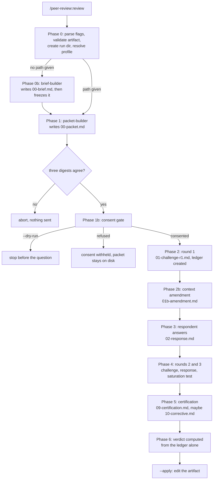

# Peer Review, one run end to end

[`peer-review.md`](peer-review.md) is the reference: setup, flags, output files, concepts. This
document is the narrative that goes with it. It follows a single invocation from the command line
to the verdict, showing what each phase writes, what the two sides actually say to each other, and
how every branch the protocol allows gets reached.

**The specifics below are invented.** The plan on trial, the repository it cites, the challenger's
findings and the respondent's evidence are a fabricated example. What is real: the phase order, the
file names, the consent gate text, the reply verbs, the nine finding states and every transition
rule. Those come from `plugins/peer-review/commands/review.md` and `plugins/peer-review/protocol/`.

The example is also deliberately maximal. One run here trips a transmission artifact, an
inadmissible falsifier, an unexplained withdrawal and a certification failure. A real run usually
produces four or five findings and none of that machinery ever fires. It is built this way so that
every state has a worked instance to point at.

## The cast

Six participants, and knowing which one is which explains most of the design.

| Who | What it is | What it can see |
|---|---|---|
| The command | `/peer-review:review`, the orchestrator | everything: it owns the ledger and every state transition |
| `packet-builder` | Claude Code subagent | the artifact and the whole repository |
| `brief-builder` | Claude Code subagent, brief mode only | the session's own context |
| The challenger | an external model on another vendor's API | the packet, and nothing else unless granted |
| `respondent` | Claude Code subagent | the whole repository (R8) |
| The transport | the `peer_ask` MCP tool | one file per call, read off disk |

The asymmetry between the challenger and the respondent is the point. The challenger sees a frozen
brief and attacks it; the respondent answers with evidence from the real thing. Neither of them
assigns a state, because both of them are participants, and the ledger belongs to the command.

## The example

The artifact is a plan:

```
docs/plans/2026-08-12-webhook-retry.md
```

It proposes adding exponential-backoff retries and a dead-letter queue to a billing webhook
handler. It names four files, rejects two alternatives with reasons, and leaves two questions open.
The repository it describes looks like this:

```
src/webhooks/handler.ts      the route and the credit path
src/config/webhooks.ts       timeouts and backoff constants
src/queue/dlq.ts             the dead-letter queue and its replay path
infra/deploy.yaml            the deployment
docs/runbooks/billing.md     named by the plan, does not exist
```

The invocation:

```
/peer-review:review docs/plans/2026-08-12-webhook-retry.md --challenger=gpt --rounds=3
```

## The run at a glance



Four of those boxes talk to the network: round 1, each later round, certification, and the
corrective round. All four travel under the one consent given at Phase 1b, and each one writes its
payload to disk before sending it.

## Phase 0: setup

Four things happen before anything is built, in this order, and the order matters.

**Flags are parsed and the mode is decided.** The first non-flag token selects it. A token that
resolves to a readable file means artifact mode. A token that looks like a path but does not exist
(it contains a separator, or ends in `.md`) stops the run with a not-found error, deliberately: a
mistyped path must never quietly become a brief-mode topic. Anything else is a topic hint for brief
mode, and no token at all is brief mode covering the session as a whole.

**`--rounds` is validated.** Valid values are `2` and `3`. Below `2` is rejected outright, citing
R11: a run with findings may never terminate after the first challenge round, because a finding
that has been raised and answered once has not been tested, it has merely been contradicted. Above
`3` is clamped, because no canonical file names exist past `07-challenge-r3.md`.

**The artifact is validated.** Anything that looks like a unified diff (`diff --git`, or `--- a/`
and `+++ b/` header pairs) or any extension outside `.md` and `.markdown` is refused, with a
pointer to `/senior-review:code-review` instead. This command reviews intent, never code changes.

**The run directory is computed, then the profile is resolved.** The directory is
`.peer-review/2026-08-12-1432-2026-08-12-webhook-retry/`, from the local timestamp and a slug of
the artifact's basename. Only then does the command call `peer_profiles` to resolve `gpt`, which is
a local capability check and not network egress. A missing profiles file, an unknown profile name,
or a profile whose `api_key_env` variable is unset stops the run here, before anything has been
written into the directory and long before anything could be sent.

## Phase 0b: the brief, when there is no file

Skip this phase in artifact mode. It exists for the other invocation:

```
/peer-review:review "the webhook retry design"
```

There is no plan on disk yet. The decisions live in the session, which is exactly the state where
an outside opinion is worth the most and where there is nothing to send. `brief-builder`
materializes them into `00-brief.md` in five fixed sections:

```markdown
# Decision Brief: the webhook retry design

## Situation
The billing webhook handler credits accounts inline and has no retry. Stripe retries on its own
for 3 days, so a handler that 500s is currently retried by the sender and by nobody else.
Sources this rests on: src/webhooks/handler.ts, src/config/webhooks.ts, infra/deploy.yaml.

## Decisions taken
### D1
decision: the retry scheduler uses a per-process mutex, not a shared Redis lock.
rationale: the service runs one replica (infra/deploy.yaml:31), so a shared lock buys nothing
and adds Redis to the critical path.

### D2
decision: failed events go to a dead-letter queue and are replayed by hand.
rationale: automatic replay of a credit operation without an idempotency key would double-credit.

## Open decisions
### O1
question: how long does a DLQ entry live before it is discarded?
options: 30 days, or forever with a manual purge.
criterion: whether finance needs to reconcile beyond the current quarter.

## Constraints
- Node 20, no new infrastructure dependencies this quarter (Ops call, 2026-08-05).

## Named sources
- src/webhooks/handler.ts: where the credit happens
- infra/deploy.yaml: the replica count D1 rests on

## Could not be sharpened
- "we should probably add metrics": no options, no criterion for deciding it.
```

Three properties of this phase are worth understanding, because they are what make brief mode
honest rather than convenient.

**The decidability self-check runs before writing.** An open decision passes only when it carries
two or more concrete options and a criterion that would settle it. A taken decision passes only
when its rationale is a claim someone could attack with evidence. "It seemed cleaner" fails.
Anything that fails goes into the `Could not be sharpened` list verbatim rather than being smoothed
into prose that reads decidable, and `packet-builder` later copies that list into the packet's
Known-weaknesses section. The one signal brief mode cannot get from a human confirmation gate is
the one it refuses to hide.

**If nothing passes, the run stops.** No taken decision and no open decision that survived the
self-check means a packet whose findings would stand on air. That is the single case the doctrine
says not to spend a run on, so the command stops and prints what was too vague.

**The brief is then frozen.** From here it is the artifact, in the R2 sense: never edited again for
the rest of the run. Wanting a different brief means a new run, not an edit. The verdict later
records that the artifact was materialized rather than independently authored, because a brief
written by the same session that made the decisions shares its blind spots, and no requirement can
remove that.

## Phase 1: building the packet

`packet-builder` writes `00-packet.md`. This is the challenger's entire world, which is the single
most useful thing to internalize about the whole tool: everything the challenger later attacks, or
fails to see, traces back to this file.

Nine sections, fixed order:

````markdown
# Challenge Packet

## 1. Mandate
Judge whether docs/plans/2026-08-12-webhook-retry.md's decisions, its plan of action, and each
rejected alternative's rationale hold up under scrutiny. Prose style, formatting, and any file
the artifact merely mentions without proposing a change to it are out of scope.

## 2. Artifact
bytes: 7412
sha256: 3f1c9d0b8a4e77ab21c6f5d9e0b3c81f2a6d4471e9c05f83bb27ae1d6c0947a0

`````markdown
# Plan: retry and dead-letter the billing webhook handler
[... the plan, embedded verbatim and unabridged. The elision is this document's, not the
packet's: the packet carries every byte, which is what the digest above is a claim about ...]
`````

## 3. Ground truth (given)
GIVEN src/webhooks/handler.ts:41: the account credit happens inline, in the same function that
  parses the event, with no persisted record of having run.
GIVEN src/config/webhooks.ts:12: MAX_BACKOFF_MS = 900_000.
GIVEN src/queue/dlq.ts:88: replay() takes a per-subscription_id advisory lock before applying.
GIVEN src/queue/dlq.ts: no column, field or migration named schema_version anywhere in the file.
GIVEN infra/deploy.yaml:31: replicas: 1.
GIVEN docs/runbooks/billing.md: named by the artifact, not read: the file does not exist.

## 4. Constraints
GIVEN: Node 20, no new infrastructure dependencies this quarter.
GIVEN: the handler must answer within 10 seconds or the sender treats it as failed.

## 5. Considered and rejected
### CR1 Scheduler locking
decision (GIVEN): the retry scheduler uses a per-process mutex, not a shared Redis lock.
rationale (TO JUDGE): the service runs one replica, so a shared lock buys nothing and adds
Redis to the critical path.

### CR2 Replay
decision (GIVEN): DLQ entries are replayed by hand, never automatically.
rationale (TO JUDGE): automatic replay of a credit without an idempotency key double-credits.

## 6. Known weaknesses of this artifact
- The plan does not say what happens to a DLQ entry whose event schema has since changed.
- The one-replica assumption behind CR1 is stated nowhere in the plan itself.
- Nothing in the plan defines when an operator is supposed to look at the DLQ.

## 7. Open questions
- How long does a DLQ entry live before it is discarded?

## 8. Out of scope
- The wire format of the events themselves.

## 9. Response contract
[the Round 1 block from round-prompts.md, verbatim]
````

Three rules govern how this file gets built, and each one exists to remove a specific way that a
review looks stronger than it is.

**Ground truth enters mechanically, not by relevance.** The builder greps the artifact for every
file path, module and document it names, reads each one, and enters one `GIVEN` line per fact with
a locator. Judgment controls how much of each source to excerpt; it never controls which sources
enter. Naming a file in the plan is what earns that file a place. This is what stops the packet
from quietly becoming a case for the defense: the builder cannot leave out the file that undermines
the plan, because it never got to decide which files were relevant.

**A file that could not be read is still recorded.** `docs/runbooks/billing.md` gets its own line
saying it does not exist. A skipped source is a gap the challenger can raise as a context request,
which is a different thing from a fact silently withheld.

**Settled choices are split in two.** Every entry under Considered and rejected carries a
`decision (GIVEN)` and a `rationale (TO JUDGE)`. The decision is not up for debate; the reasoning
is. That split is the whole reason a challenger can go after a bad reason for a choice without
relitigating the choice itself, and it applies to a direction taken exactly as it applies to an
alternative dismissed.

Section 6 is written by the builder against its own side, and at least three genuine weaknesses are
required. A section that comes back thin is treated as a signal about the run, never as evidence
that the artifact is strong.

### The digest check that actually catches something

The artifact is spliced into the packet as raw bytes, never retyped and never passed through a
read-then-write path. On a Windows checkout, reproducing it through a model's own output silently
normalizes CRLF to LF, and the recorded digest then describes bytes the packet does not contain.

When `packet-builder` returns, the command verifies **three** values, not two:

| # | Value | Computed from |
|---|---|---|
| 1 | bytes and sha256 of the source | `docs/plans/2026-08-12-webhook-retry.md` on disk |
| 2 | the `bytes:` and `sha256:` lines in the packet | what the packet claims about the source |
| 3 | bytes and sha256 of the embedded text | the block actually sitting inside `00-packet.md` |

Checking 1 against 2 proves nothing: both are computed from the same file by the same method, so
they agree by construction and report confidence they have not earned. Value 3 is the one that can
fail, because it measures the text the outgoing request will actually carry. Any disagreement
aborts the run before a single transport call, and the run directory is left in place for
inspection. This is a run-invalidating defect, never a warning.

## Phase 1b: the consent gate

No transport call of any kind precedes this phase. The command hashes the packet file itself
(Phase 1 hashed the artifact; what travels is the whole packet), checks it against the transport's
400000-byte cap, and then presents this, verbatim:

```
About to send this packet to an external service:
  destination: https://api.openai.com/v1  model: gpt-5.6
  size: 48213 bytes (transport cap: 400000 bytes)
  sha256: 9f2c1a77b0e3d4482ac9f61b5d0e7738cc41ab902f6e5d3c8471be09a2d5f41a
  sections: Mandate, Artifact, Ground truth, Constraints, Considered and rejected,
            Known weaknesses, Open questions, Out of scope, Response contract
Nothing else leaves this machine. Later rounds, certification, a corrective round
and any granted repository excerpt travel under this same consent.
```

and then asks, as a question with visible options:

> **Send this packet to gpt-5.6 at https://api.openai.com/v1?**
> **Send it** or **Do not send**

Five things about this gate are load-bearing.

**It is asked, not printed.** A run that displays the disclosure and then falls silent is
indistinguishable from a run that finished, and an operator reading it that way waits forever on a
run that is waiting on them. The disclosure is output; the gate is a question.

**The answer is read for meaning, never matched against a word.** `ok`, `sì`, `vai`, `send it`,
`go ahead` all proceed. `no`, `stop`, `annulla` all abort with the packet left on disk. This is a
dialogue between two people, and refusing a clear yes over its wording is a defect rather than
caution.

**A question back is not a refusal.** Ask what is in the packet and you get an answer and the
question again, against the same frozen bytes. An affirmative carrying a condition ("yes, without
the appendix") is not consent yet either: it gets answered and re-asked. A genuinely unclear reply
is asked about once more, and a second unclear reply ends the run with consent withheld. Silence is
never consent.

**The digest is shown because consent attaches to a document, not to an intention.** The transport
reports back the digest of what it actually sent, and Phase 2 compares the two. That comparison is
what makes this a decision about specific bytes.

**One yes covers the whole run.** Rounds 2 and 3, certification, the corrective round, and up to 10
files or 200 KB of repository material granted to a context request. That is disclosed here,
before the question, precisely so that it cannot be a surprise later.

`--dry-run` stops immediately before the question and reports the packet path. Nothing was sent,
and the packet is there to read. Reading it once is the highest-value habit with this tool: a
disappointing run traces back to a thin packet far more often than to a weak challenger.

## Phase 2: round 1, the challenge

The command reads the Round 1 prompt out of `protocol/round-prompts.md` and calls `peer_ask` with
`content_path` pointing at `00-packet.md`. **The packet is never pasted into the call.** The
transport opens the file itself, which is R15's third link made mechanical: a participant asked to
reproduce tens of kilobytes into a tool argument will summarize it under length, silently, and
every downstream check would then describe a document the challenger never received.

The reply comes back and the command first compares its `sent_sha256` against the digest shown at
the gate. A mismatch means the packet changed on disk between consent and call, so no challenge
file is written, the ledger is not touched, and the run stops.

`01-challenge-r1.md`, written verbatim from the reply:

```markdown
## Frame challenge
The mandate asks whether the plan holds up, but the plan's decomposition assumes retry and
dead-lettering are one change. They are two: retry is safe only once the credit path is
idempotent, and the DLQ is useful only once someone is told to look at it. CR2's rationale is
the one that does not hold on its own terms: it names double-crediting as the reason to avoid
automatic replay, which is an argument for an idempotency key, not against automation.

## Context requests
- src/webhooks/handler.ts
- src/queue/dlq.ts
- https://stripe.com/docs/webhooks
- ../../ops-secrets/billing.env
- docs/plans/2026-08-12-webhook-retry.md
- docs/runbooks/billing.md

## Findings
[F01] claim: The retry loop re-runs the handler body with no idempotency key, so a retried
      invoice.paid credits the account twice.
      section attacked: Ground truth
      failure scenario: the handler credits, then times out before answering; the sender
      retries; the credit runs again against the same event id.
      severity: critical
      falsifier: a persisted idempotency record consulted before the credit, at a named locator.

[F02] claim: The backoff schedule outlives the sender's own retry window, so the DLQ fills with
      events the sender is still retrying independently.
      section attacked: Artifact
      failure scenario: an event is retried locally for hours while the sender also retries it,
      producing duplicate processing attempts from two schedulers.
      severity: major
      falsifier: a configured maximum backoff below one hour, at a named locator.

[F03] claim: The DLQ replay path applies entries with no ordering guarantee, so replaying two
      events for one subscription can apply them out of order.
      section attacked: Artifact
      failure scenario: an operator replays a cancel and a renewal together; the cancel lands
      second and the subscription ends up wrongly terminated.
      severity: major
      falsifier: a per-entity serialization mechanism in the replay path, at a named locator.

[F04] claim: CR1's rationale rests on a replica count the plan never states, and a per-process
      mutex is unsafe the moment a second replica exists.
      section attacked: Considered and rejected
      failure scenario: an autoscaler adds a replica under load; two schedulers retry the same
      event concurrently.
      severity: major
      falsifier: evidence that the deployment cannot scale beyond one replica, at a named
      locator.

[F05] claim: The plan is not durable against event schema drift in stored DLQ entries.
      section attacked: Known weaknesses
      failure scenario: an entry stored under an older event shape is replayed after a
      deploy and is misparsed.
      severity: minor
      falsifier: evidence that the design is future-proof.

[F06] claim: Nothing in the plan defines the signal that tells an operator the DLQ needs
      attention, so the DLQ is write-only in practice.
      section attacked: Artifact
      failure scenario: entries accumulate for weeks; the first person to notice is a customer.
      severity: minor
      falsifier: an alert, metric or scheduled report on DLQ depth.

[F07] claim: The SQS fallback described in the plan's section 6 contradicts the constraint
      forbidding new infrastructure this quarter.
      section attacked: Artifact
      failure scenario: the fallback is implemented and the constraint is violated.
      severity: major
      falsifier: removal of the SQS fallback, or a waiver of the constraint.

[F08] claim: The handler verifies the sender's signature after parsing the body, so a forged
      payload reaches the parser.
      section attacked: Ground truth
      failure scenario: an attacker posts a malformed body; the parser runs on unauthenticated
      input.
      severity: critical
      falsifier: a signature check that runs before any parsing, at a named locator.

## Cannot assess
Whether the credit path is already idempotent somewhere upstream: the packet gives me line 41
and nothing around it.

## Strongest objection
F01. Everything else in this plan is a refinement; without an idempotency key, retry is a
mechanism for duplicating money movements on a schedule.
```

Two things happen the moment this file lands.

**The ledger is created.** One entry per finding, from the template in `finding-lifecycle.md`:

```
Finding F01
  claim (verbatim): The retry loop re-runs the handler body with no idempotency key, so a
    retried invoice.paid credits the account twice.
  falsifier (verbatim): a persisted idempotency record consulted before the credit, at a named
    locator. | admissibility: (pending)
  challenger evidence: handler credits then times out; sender retries; credit runs again on the
    same event id.
  respondent position: (pending)
  respondent evidence: (pending)
  restatements: none
  state: OPEN
  new evidence since previous round: n/a (round 1)
  history:
    - R1: raised (severity critical)
```

The `claim` and `falsifier` fields are copied verbatim and never rewritten for the rest of the run
(R10). Everything the run later decides is decided against those exact words, which is what makes
the certification pass in Phase 5 a real check rather than a formality.

**The transmission-artifact check runs, before any finding is left OPEN.** For each finding, the
command looks for the material its claim actually references anywhere in `00-packet.md`. Two
outcomes:

- **F07** attacks "the plan's section 6 SQS fallback". There is no SQS anywhere in the packet, and
  the packet has been proved byte-identical to the source (Phase 1) and to the request (the
  `sent_sha256` comparison above). So the material cannot be a live claim about the artifact: it is
  noise the challenger introduced. F07 goes straight to `TRANSMISSION_ARTIFACT`, skipping `OPEN`,
  and is never sent to the respondent.
- **F08** also labels itself `section attacked: Ground truth`, and the packet's ground truth says
  nothing about the order of signature verification. But the substance is in the packet: the
  embedded plan describes the handler's order of operations. So this is a labeling mismatch, not a
  transmission artifact. The finding stays `OPEN`, a soft note naming the section the substance was
  actually found in goes into its history, and the respondent judges it on its merits regardless of
  which section the challenger thought it lived in.

The check is keyed on substance rather than on the free-text label precisely because of that
difference. A challenger writing in its own words will misfile a section routinely; only material
that cannot be located anywhere in the packet is noise it introduced.

Both halves of the check are load-bearing. Without the digest verification of the sending side,
this check would archive as challenger noise whatever the sender had dropped, and every one of its
mistakes would fall on the side of absolving the artifact.

## Phase 2b: the context amendment

The challenger asked for six locators. Each is decided in order against fixed rules, with running
totals, and the result is written to `01b-amendment.md`:

```markdown
# Context Amendment, Round 1

## Granted
| Locator | Bytes | Note |
|---|---|---|
| src/webhooks/handler.ts | 4188 | |
| src/queue/dlq.ts | 6903 | |

## Refused
| Locator | Reason |
|---|---|
| https://stripe.com/docs/webhooks | outside the repository |
| ../../ops-secrets/billing.env | outside the repository |
| docs/plans/2026-08-12-webhook-retry.md | already in the packet |
| docs/runbooks/billing.md | not found |

Running totals: 2 files / 10, 11 KB / 200 KB.
```

The cap is 10 files or 200 KB, whichever is reached first, and it is a refusal reason like the
others. Two details are easy to miss and worth stating.

**Granted material goes to the challenger, not to the respondent.** The respondent already has full
repository access under R8 and needs nothing from this. The grants are prepended to round 2's
payload, each fact tagged `GIVEN` with its locator, because the challenger's whole world is what it
was handed.

**Refusals are reported in the verdict.** A run with several refused context requests reviewed less
than it appears to have reviewed, and that belongs in the output rather than in a log nobody reads.

## Phase 3: the response to round 1

The respondent gets the challenge file and the ledger, and answers every finding whose state is
`OPEN`. Findings already `TRANSMISSION_ARTIFACT` are closed and are not re-opened.

Before investigating anything, it runs the **admissibility check** on each falsifier (R9), asking
three questions: is it decidable against the source or a runnable procedure, is it decidable in
bounded effort, and is it actually dispositive for the claim. The outcome is `OK`, `RESTATED`, or
`INADMISSIBLE`, and this happens **before** any evidence gathering, because investigating an
undecidable falsifier is how a run spends its budget producing an opinion.

Then it verdicts each finding with one of four positions, every non-ACCEPT carrying a locator:

| Position | Means |
|---|---|
| ACCEPT | the finding is correct, verified against the source; it becomes a concrete edit |
| REFUTE | positive evidence at a locator satisfies the falsifier exactly as stated |
| NEEDS-EVIDENCE | the falsifier is admissible but available material does not settle it either way |
| DISAGREE | the material was located and read, but the conclusion drawn from it is disputed |

`02-response.md`:

```markdown
[F01] admissibility: OK
      position: ACCEPT
      evidence: src/webhooks/handler.ts:41-58. The credit runs inline and no table, cache or
      column records the event id. I looked for one: there is no idempotency store in the
      repository at all. The finding holds and the plan needs a step before retry is safe.

[F02] admissibility: OK
      position: REFUTE
      evidence: src/config/webhooks.ts:12, MAX_BACKOFF_MS = 900_000, fifteen minutes. The
      falsifier asked for a configured maximum backoff below one hour at a named locator, and
      this is it, as stated.
      promotion: GIVEN -> DERIVED (re-derived by respondent from src/config/webhooks.ts:12)

[F03] admissibility: OK
      position: REFUTE
      evidence: src/queue/dlq.ts:88-104. replay() acquires a per-subscription_id advisory lock
      and releases it after apply(), so two entries for one subscription serialize.

[F04] admissibility: OK
      position: DISAGREE
      evidence: infra/deploy.yaml:31, replicas: 1, and no HorizontalPodAutoscaler exists in
      infra/. I have read the material the finding turns on and dispute the conclusion: the
      deployment does not scale today. I am not claiming it cannot be changed.

[F05] admissibility: RESTATED
      "evidence that the design is future-proof" is not decidable against any source: no
      artifact can exhibit it. Requesting one restatement. A decidable form would be: a version
      field or documented migration on stored DLQ entries, at a named locator.

[F06] admissibility: RESTATED
      "an alert, metric or scheduled report" is three different checks and none of them is
      named precisely enough to be dispositive. Requesting one restatement, proposed: a
      dashboard, alert rule or scheduled job that reads DLQ depth, at a named locator.

[F08] admissibility: OK
      position: REFUTE
      evidence: src/webhooks/handler.ts:22-29. verifySignature(raw, header) runs on the raw
      body and returns before JSON.parse is reached at line 31. The falsifier asked for a
      signature check before any parsing, at a named locator, and this is it.
```

Note F02's `promotion` line. The packet already carried `MAX_BACKOFF_MS = 900_000` as a `GIVEN`
fact. Repeating a GIVEN corroborates nothing at all, including when the respondent repeats it. What
counts is that the respondent went to `src/config/webhooks.ts` itself and read it there, and the
ledger records `GIVEN -> DERIVED` with the deriving role and the locator. This is R14, and it is
the single most common way a run's evidence looks stronger than it is: two participants agreeing
because they both read the same handed-over sentence is one observation, not two.

The command then applies the transitions. The respondent never sets a state:

| Respondent result | New state |
|---|---|
| admissibility `INADMISSIBLE` (restatement already spent) | `UNTESTABLE` |
| admissibility `RESTATED`, awaiting confirmation | stays `OPEN`, carried forward |
| `OK` + ACCEPT | `RESOLVED_ACCEPT` |
| `OK` + REFUTE | `CHALLENGED` (not resolved: the challenger has not seen the refutation yet) |
| `OK` + NEEDS-EVIDENCE or DISAGREE | `CHALLENGED` |

Ledger after round 1:

| Finding | State | Why |
|---|---|---|
| F01 | RESOLVED_ACCEPT | accepted with verification |
| F02 | CHALLENGED | refuted, awaiting the challenger's reply |
| F03 | CHALLENGED | refuted, awaiting the challenger's reply |
| F04 | CHALLENGED | disagreed with a locator |
| F05 | OPEN | restatement proposed, not yet confirmed |
| F06 | OPEN | restatement proposed, not yet confirmed |
| F07 | TRANSMISSION_ARTIFACT | terminal, never sent to the respondent |
| F08 | CHALLENGED | refuted, awaiting the challenger's reply |

A `REFUTE` producing `CHALLENGED` rather than `RESOLVED_REFUTE` is not bookkeeping pedantry.
`RESOLVED_REFUTE` is assigned in exactly one place in the entire run, Phase 5, and only after the
challenger has seen how its own claim was rendered and confirmed the rendering. Until then a
refutation is a position, not an outcome.

## Phase 4: the back and forth

This is the "botta e risposta". Rounds 2 and 3 each run the same four steps, and each round
processes only the **still-open set**: everything `OPEN` or `CHALLENGED`, minus anything terminal,
minus anything flagged saturated.

**Step 1, build the payload.** For each still-open finding: its claim and falsifier verbatim, the
respondent's current position and evidence, and (round 2 only) the material granted in Phase 2b,
tagged `GIVEN` with locators. A finding carrying a pending restatement is shown with that proposed
wording, labeled as awaiting confirmation, so there is something concrete for the challenger to
confirm or reject.

**Step 2, write the payload, then send it.** It goes to `sent/r2.md` first, and `peer_ask` reads it
from there. The file is not a record of what was sent: it is what was sent.

**Step 3, apply the challenger's reply.** Exactly one verb per finding:

| Verb | Effect |
|---|---|
| `WITHDRAW` naming falsifying evidence | `RESOLVED_WITHDRAWN` |
| `WITHDRAW` naming nothing | does **not** close. Stays `CHALLENGED`, flagged `unexplained withdrawal`, reported in the verdict as a weakness of the run whatever happens next |
| `MAINTAIN` with new evidence or a new argument | stays `CHALLENGED`, challenger side records new evidence YES |
| `MAINTAIN` stating "no new evidence" | stays `CHALLENGED`, records NO. This is what feeds the saturation test |
| `REFINE` | the restated wording is recorded alongside the original, which is never overwritten |
| `CONFIRM-RESTATEMENT` | the proposed falsifier becomes admissible; the finding returns to `OPEN` and is investigated for the first time this round |
| `REJECT-RESTATEMENT` | the one restatement R9 allows is spent and refused, and the original falsifier was already inadmissible, so `UNTESTABLE` now |

Round 2's reply, in our run:

```markdown
[F02] WITHDRAW. src/config/webhooks.ts:12 shows 900_000 ms, fifteen minutes, which is inside
      the sender's own window. My claim was wrong.

[F03] MAINTAIN. No new evidence. The advisory lock serializes concurrent replays; my claim was
      about the order two sequential replays are applied in, which a lock does not fix.

[F04] MAINTAIN. New argument: the absence of an autoscaler today is not a property of the
      design, and CR1's rationale is stated as a property of the design.

[F05] REJECT-RESTATEMENT. "Future-proof" is what I meant and I am not narrowing it.

[F06] CONFIRM-RESTATEMENT. A dashboard, alert rule or scheduled job that reads DLQ depth, at a
      named locator. Adopted as the falsifier.

[F08] WITHDRAW.
```

Read what each of those does.

- **F02** closes: `RESOLVED_WITHDRAWN`, evidence named. This is a successful outcome, not a wasted
  finding.
- **F03** stays `CHALLENGED` with the challenger recording no new evidence.
- **F04** stays `CHALLENGED` with new evidence YES on the challenger side.
- **F05** becomes `UNTESTABLE`. The falsifier was never decidable, the one restatement was refused,
  and the run stops spending budget on it. Untestable is neither accepted nor refuted, and the
  verdict says so in its own section: it is not evidence the plan is fine.
- **F06** returns to `OPEN` with an admissible falsifier and gets investigated in this round's
  response step.
- **F08** is a withdrawal naming no evidence. It does **not** close. The finding stays `CHALLENGED`
  and carries a permanent `unexplained withdrawal` flag into the verdict. A challenger that drops a
  claim without saying what killed it has told you something about the run, and the protocol
  refuses to let that disappear into a clean-looking outcome.

**Step 4, the respondent answers again**, same shape as Phase 3, writing `06-response-r2.md`, and
now also reporting whether it has new evidence of its own this round. In our run: F03 REFUTE
unchanged, no new evidence. F04 DISAGREE, new evidence YES (it read the deployment history and
found the replica count has never changed). F06 ACCEPT: it looked for a dashboard, alert or job
reading DLQ depth and found none, so the finding holds and becomes an accepted change. F08 REFUTE
unchanged, no new evidence.

### The saturation test

Run per finding, per round, and entirely mechanical:

```
challenger new evidence = NO
AND respondent new evidence = NO
AND neither position changed
=> this finding takes no further rounds
```

What it becomes then depends on the respondent's position, and this is the distinction that keeps
`STANDOFF` meaningful:

- **Position REFUTE**: the finding is *not* set to `STANDOFF`. A surviving refutation is not both
  substantive positions surviving. It stays `CHALLENGED`, gets flagged `saturated: no further
  rounds`, is excluded from later rounds, and carries to certification as a proposed refutation.
- **Any other position**: `STANDOFF` immediately, labeled `saturation`.

In round 2, F03 saturates (both sides NO, positions unchanged, respondent REFUTE), so it is flagged
and carried to certification. F04 does not saturate: the challenger brought a new argument and the
respondent brought new evidence.

Round 3 runs for the remainder. The challenger MAINTAINs F04 with no new evidence and MAINTAINs F08
with no new evidence; the respondent has nothing new for either. F04 saturates with position
DISAGREE, so it becomes `STANDOFF` labeled saturation. F08 saturates with position REFUTE, so it
carries to certification, still flagged for its unexplained withdrawal.

### The round cap

After the last round runs, anything still open is resolved by its most recent respondent position,
never swept as one block:

| Still open at the cap | Becomes |
|---|---|
| `CHALLENGED`, respondent position REFUTE | not swept: carries to certification as a proposed refutation |
| `CHALLENGED`, position NEEDS-EVIDENCE, DISAGREE, or none | `STANDOFF`, labeled `cap-terminated` |
| `OPEN` (a restatement the challenger never confirmed) | `UNTESTABLE`, never `STANDOFF` |

That last row matters: an unconfirmed restatement is a procedural failure, and procedural failures
route to `UNTESTABLE`, `TRANSMISSION_ARTIFACT` or `CERTIFICATION_FAILED`. They never manufacture a
standoff. `STANDOFF` means exactly one thing in this protocol, which is that both substantive
positions survived the evidence available, and diluting it with procedural deaths would destroy the
one output the run exists to hand a human.

## Phase 5: certification, the challenger's last word

Every finding except the transmission artifacts goes back to the challenger one final time, with
its proposed terminal state and a one-line rendering of how it closed, in the respondent's own
words. The prompt is explicit that this is not a debate round: no new findings, no new evidence.

The payload goes to `sent/certification.md`, and the reply to `09-certification.md`:

```markdown
[F01] MISREPRESENTED. Rendered as "the plan lacks an idempotency key". My words were "the retry
      loop re-runs the handler body with no idempotency key". The rendering is narrower than
      my claim.

[F02] CERTIFIED.
[F03] CERTIFIED. The rendering states the lock argument correctly even though I disagree with it.
[F04] MISREPRESENTED. Rendered as "the deployment cannot scale". I said a per-process mutex is
      unsafe the moment a second replica exists.
[F05] CERTIFIED.
[F06] CERTIFIED.
[F08] MISREPRESENTED. Rendered as "the signature is verified first, so the finding is wrong". My
      claim was that verification happens after parsing. The rendering asserts the opposite of
      my claim as though it were my claim.
```

Three flags, three different outcomes, and the differences are the whole mechanism:

- **F01, unsubstantiated.** There is no real contradiction between the claim and the rendering: one
  is a shorter phrasing of the other, checked against the ledger's verbatim `claim` field, which
  has not changed since round 1. The flag is discarded, noted in history, and the state finalizes
  as `RESOLVED_ACCEPT`.
- **F04, substantiated but out of scope.** The rendering genuinely differs, but F04 closed as a
  `STANDOFF`, not as a refutation. R12 scopes this mechanism to a refutation's rendering, so there
  is nothing to invalidate: the state stands, and the flag is recorded as a rendering dispute
  carried alongside the finding in the verdict.
- **F08, substantiated and on a refutation.** This is the real case. The proposed closure is
  invalidated, any restatement is struck, and the finding reverts to `CHALLENGED`.

Everything else certifies. F03, the saturated refutation, becomes `RESOLVED_REFUTE` here, which is
the only place in the entire run that state is ever assigned.

### The corrective round

Reverted findings get one corrective round, once for the whole run. Only F08's original verbatim
claim and falsifier go to `sent/corrective.md`, under a framing that says answer against your
original claim, this is a corrective round and not a debate. The challenger's answer lands under
`## Challenger` in `10-corrective.md`, and the respondent appends its answer under `## Respondent`
in the same file, the one file in the layout that belongs to both roles.

That answer is final. There is no second certification pass, because that would make the
one-corrective-round cap meaningless:

| Respondent's corrective answer | Terminal state |
|---|---|
| ACCEPT | `RESOLVED_ACCEPT` |
| REFUTE | `RESOLVED_REFUTE` |
| NEEDS-EVIDENCE or DISAGREE | `CERTIFICATION_FAILED` |

In our run the respondent restates its position against the original claim and lands on DISAGREE,
so F08 terminates `CERTIFICATION_FAILED`: neither accepted nor refuted, reported in its own verdict
section. A misrepresentation never manufactures a standoff.

## Phase 6: the verdict

`04-verdict.md` is computed from `03-ledger.md` alone. No fact enters here that is not already a
ledger field, and prose may explain a state but never assign or change one. Twelve sections, in
this order:

| # | Section | This run |
|---|---|---|
| 1 | Accepted changes | F01 (idempotency record before the credit), F06 (a DLQ depth signal) |
| 2 | Refutations with evidence | F03, with `src/queue/dlq.ts:88-104` |
| 3 | Standoffs | F04, labeled saturation, with what would settle it |
| 4 | Untestable | F05, restatement rejected by the challenger |
| 5 | Certification failures | F08, with the substantiated misrepresentation |
| 6 | Transmission artifacts | F07, with both digest links, and a recommendation to repeat the run |
| 7 | Unexplained withdrawals | F08's round 2 withdrawal, reported as a weakness of the run |
| 8 | Refused context requests | the four refusals from `01b-amendment.md`, with reasons |
| 9 | Provenance, four axes per role | three rows, plus the artifact-origin line |
| 10 | Promotions | F02's `GIVEN -> DERIVED` on `src/config/webhooks.ts:12` |
| 11 | Transmission and token accounting | per call: model, usage, latency, sent bytes, sent digest |
| 12 | The closing note | finding count is never the quality measure |

The first three sections carry decisions; everything after them describes the health of the run
that produced those decisions. Sections 4, 5 and 6 are findings that died procedurally rather than
on the merits, so none of them is evidence that the artifact is sound. Sections 7 and 8 are gaps:
a claim dropped without a reason, and material the challenger wanted and did not get.

Section 9 is the one most worth reading twice. The four axes (model, runtime, context, human) are
recorded per role and never collapsed into a score:

```
Packet builder   model: the session's own model | runtime: Claude Code subagent
                 packet-builder | context: full repository | human: none
Challenger       model: gpt-5.6 | runtime: https://api.openai.com/v1 | context: packet-only
                 plus 2 granted files, tagged GIVEN | human: none
Respondent       model: the session's own model | runtime: Claude Code subagent respondent
                 with full repository access | context: full repository | human: none

Artifact origin: pre-existing, docs/plans/2026-08-12-webhook-retry.md
```

`context: packet-only` on the challenger is a standing limit, not a defect of this run: a
participant with no independent path to the authoritative source can never promote a GIVEN fact to
DERIVED, so its agreement with anything you supplied is repetition. That is precisely why the
promotion in section 10 came from the respondent.

And the artifact-origin line reads `materialized for this run by peer-review:brief-builder` in
brief mode, which a reader has to weigh: a brief drafted by the same session that made the
decisions shares that session's blind spots.

## `--apply`

Only after the verdict exists, and artifact mode only.

Without the flag, the Accepted changes list is printed and nothing is modified. With it, each entry
is applied to the artifact with the Edit tool and a changelog section is appended:

```markdown
## Peer review 2026-08-12

Reviewed via /peer-review:review. Full run: `.peer-review/2026-08-12-1432-2026-08-12-webhook-retry/`.
Accepted: 2. Refuted: 1. Standoffs: 1. See 04-verdict.md for detail.
```

The artifact is never touched before this point (R2). A changed artifact is a new run, not a
resumed one.

In brief mode the flag is refused, and it says so rather than silently ignoring it: the artifact is
a frozen record of what the session had decided, nothing downstream reads it, and the deliverable
is a list of decisions to revisit rather than text to rewrite.

## Every finding, start to finish

| ID | Round 1 | Round 2 | Round 3 | Certification | Terminal |
|---|---|---|---|---|---|
| F01 | ACCEPT | terminal | | flag discarded | `RESOLVED_ACCEPT` |
| F02 | REFUTE | WITHDRAW with evidence | | CERTIFIED | `RESOLVED_WITHDRAWN` |
| F03 | REFUTE | MAINTAIN, no new evidence, saturated | not resent | CERTIFIED | `RESOLVED_REFUTE` |
| F04 | DISAGREE | MAINTAIN, new argument | saturated, both sides NO | flag out of scope | `STANDOFF` |
| F05 | falsifier RESTATED | REJECT-RESTATEMENT | | CERTIFIED | `UNTESTABLE` |
| F06 | falsifier RESTATED | CONFIRM-RESTATEMENT, then ACCEPT | | CERTIFIED | `RESOLVED_ACCEPT` |
| F07 | never reached the respondent | | | excluded | `TRANSMISSION_ARTIFACT` |
| F08 | REFUTE | WITHDRAW naming nothing | MAINTAIN, saturated | MISREPRESENTED, corrective, DISAGREE | `CERTIFICATION_FAILED` |

Eight findings, two accepted changes, one evidenced refutation, one standoff for a human to settle,
and four findings that died in ways the verdict reports separately because none of them is evidence
about the plan. That distribution is the deliverable. Twelve findings destroyed with evidence is a
success; one finding that changes a decision is a success; a precise standoff left for you is a
success. What the run reduces is decisional uncertainty, and finding count measures nothing.

## Where a run can stop

Not every invocation reaches Phase 6. Each stop is deliberate, and each leaves something specific
behind.

| Phase | Trigger | State on disk |
|---|---|---|
| 0 | `--rounds` below 2, a path that does not exist, a diff or source file | nothing written |
| 0 | no profiles file, unknown profile name, key variable unset | the run directory, empty |
| 0b | the brief carries no decidable decision | `00-brief.md`, with the could-not-be-sharpened list printed |
| 1 | `packet-builder` did not write the packet | the run directory |
| 1 | the three digests disagree | `00-packet.md`, left for inspection. Nothing sent |
| 1b | packet larger than 400000 bytes | `00-packet.md`. The gate is not even presented: approving a payload the transport will refuse is not a real consent decision |
| 1b | `--dry-run` | `00-packet.md`. Stopped before the question |
| 1b | consent withheld, or a second unclear reply | `00-packet.md` |
| 2 | `sent_sha256` differs from the digest shown at the gate | no challenge file, no ledger |
| 2 | transport error on the very first call | the command reports the verbatim error and asks whether to resend the same packet under the consent already given, or end the run |
| 2, 4, 5 | transport error later in the run | no further calls; straight to Phase 6, with a transport-failure section and every unanswered finding reported as interrupted rather than folded into `STANDOFF` |

The last row is the one that shows the design's temperament. An unanswered call is not the same
claim as a saturated one, and a verdict that quietly recorded it as a standoff would be reporting a
substantive result that never happened.

**Related:** [peer-review](peer-review.md) (setup, flags, output reference) | [senior-review](senior-review.md) (diffs and PRs, which this command refuses on purpose)
