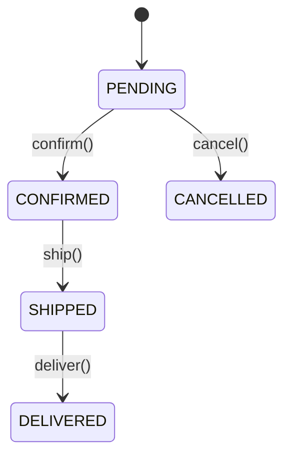

# Semantic Pattern Recognition Guide

> Patterns Claude should recognize, understand, and document during code analysis.

---

## How to Use This Guide

When analyzing code, Claude should:
1. **Recognize** - Identify which pattern(s) the code implements
2. **Understand** - Know the intent and trade-offs of the pattern
3. **Document** - Explain the pattern and its specific implementation
4. **Evaluate** - Assess if the pattern is correctly applied

---

## Architectural Patterns

### Repository Pattern
```
SIGNATURE:
- Class with get/find/save/delete methods
- Abstracts data storage
- Returns domain objects, not raw data

RECOGNIZE BY:
class UserRepository:
    def get_by_id(self, id) -> User
    def find_by_email(self, email) -> User | None
    def save(self, user: User) -> None
    def delete(self, user: User) -> None

DOCUMENT AS:
"Repository pattern abstracting {storage_type} access for {entity}.
Provides {list operations}. Uses {caching_strategy if any}."

EVALUATE:
□ Does it hide storage details completely?
□ Are queries in repository or leaking to callers?
□ Is there proper transaction handling?
```

### Service Layer Pattern
```
SIGNATURE:
- Orchestrates multiple repositories/adapters
- Contains business logic
- No direct database access

RECOGNIZE BY:
class OrderService:
    def __init__(self, order_repo, inventory_service, payment_gateway):
        ...
    def place_order(self, cart, user) -> Order:
        # Coordinates multiple operations

DOCUMENT AS:
"Service layer for {domain_area}. Orchestrates {list_of_dependencies}.
Responsible for {list_business_operations}."

EVALUATE:
□ Is business logic here or scattered?
□ Does it properly coordinate transactions?
□ Are dependencies injected (testable)?
```

### Event-Driven Architecture
```
SIGNATURE:
- Event classes/messages
- Publishers and subscribers
- Decoupled components

RECOGNIZE BY:
class OrderPlacedEvent:
    order_id: str
    user_id: str
    timestamp: datetime

event_bus.publish(OrderPlacedEvent(...))

@event_handler(OrderPlacedEvent)
def send_confirmation_email(event):
    ...

DOCUMENT AS:
"Event-driven flow: {trigger} → {event} → {handlers}.
{Sync/Async} delivery with {ordering_guarantee}."

EVALUATE:
□ Are events immutable?
□ Is ordering guaranteed when needed?
□ How are failed handlers retried?
□ Is there event versioning?
```

### CQRS (Command Query Responsibility Segregation)
```
SIGNATURE:
- Separate read and write models
- Commands for writes, Queries for reads
- Often separate databases

RECOGNIZE BY:
# Commands (write)
class CreateOrderCommand:
    ...
def handle_create_order(cmd: CreateOrderCommand):
    ...

# Queries (read)
class OrderSummaryQuery:
    ...
def handle_order_summary(query: OrderSummaryQuery):
    ...

DOCUMENT AS:
"CQRS pattern with {write_model} and {read_model}.
Commands: {list}. Queries: {list}.
Synchronization via {mechanism}."

EVALUATE:
□ Is read/write separation consistent?
□ How is eventual consistency handled?
□ Is complexity justified by requirements?
```

---

## Behavioral Patterns

### State Machine
```
SIGNATURE:
- Enum of states
- Defined transitions
- State-dependent behavior

RECOGNIZE BY:
class OrderState(Enum):
    PENDING = "pending"
    CONFIRMED = "confirmed"
    SHIPPED = "shipped"
    DELIVERED = "delivered"
    CANCELLED = "cancelled"

def confirm(self):
    if self.state != OrderState.PENDING:
        raise InvalidTransition()
    self.state = OrderState.CONFIRMED

DOCUMENT AS:


EVALUATE:
□ Are all transitions explicit?
□ Are invalid transitions prevented?
□ Is there a terminal state?
□ Can the machine get stuck?
```

### Strategy Pattern
```
SIGNATURE:
- Interface defining algorithm
- Multiple implementations
- Runtime selection

RECOGNIZE BY:
class PricingStrategy(Protocol):
    def calculate(self, order: Order) -> Decimal

class StandardPricing(PricingStrategy):
    def calculate(self, order): ...

class DiscountPricing(PricingStrategy):
    def calculate(self, order): ...

# Usage
strategy = get_pricing_strategy(customer_type)
price = strategy.calculate(order)

DOCUMENT AS:
"Strategy pattern for {what_varies}.
Implementations: {list_strategies}.
Selection based on {criteria}."

EVALUATE:
□ Is the interface minimal?
□ Are strategies truly interchangeable?
□ Is selection logic centralized?
```

### Observer Pattern
```
SIGNATURE:
- Subject maintains observer list
- Observers notified on state change
- Decoupled notification

RECOGNIZE BY:
class Observable:
    def __init__(self):
        self._observers = []

    def subscribe(self, observer):
        self._observers.append(observer)

    def notify(self, event):
        for observer in self._observers:
            observer.on_event(event)

DOCUMENT AS:
"Observer pattern: {subject} notifies {observer_types} on {events}.
{Sync/async} notification. {Ordering} guarantees."

EVALUATE:
□ Can observers unsubscribe?
□ Is notification order-independent?
□ Are observer exceptions isolated?
```

### Chain of Responsibility
```
SIGNATURE:
- Sequence of handlers
- Each can handle or pass
- Request flows until handled

RECOGNIZE BY:
class Handler:
    def __init__(self, next_handler=None):
        self.next = next_handler

    def handle(self, request):
        if self.can_handle(request):
            return self.do_handle(request)
        elif self.next:
            return self.next.handle(request)
        raise UnhandledRequest()

DOCUMENT AS:
"Chain of responsibility for {request_type}.
Chain order: {handler1} → {handler2} → {handler3}.
Fallback behavior: {what_happens_if_unhandled}."

EVALUATE:
□ Is chain order significant?
□ Can multiple handlers act on same request?
□ Is there a default/fallback handler?
```

---

## Resilience Patterns

### Circuit Breaker
```
SIGNATURE:
- Tracks failures
- Opens after threshold
- Allows periodic retry

RECOGNIZE BY:
class CircuitBreaker:
    def __init__(self, failure_threshold, reset_timeout):
        self.state = "closed"
        self.failures = 0

    def call(self, func):
        if self.state == "open":
            if self.should_try_reset():
                self.state = "half-open"
            else:
                raise CircuitOpen()
        try:
            result = func()
            self.on_success()
            return result
        except Exception:
            self.on_failure()
            raise

DOCUMENT AS:
"Circuit breaker protecting {resource/service}.
Threshold: {N} failures in {time_window}.
Reset timeout: {duration}. Half-open allows {N} test requests."

EVALUATE:
□ Is threshold appropriate for the service?
□ Are the right exceptions triggering failures?
□ Is there alerting when circuit opens?
```

### Retry with Backoff
```
SIGNATURE:
- Retries on failure
- Increasing delays
- Maximum attempts

RECOGNIZE BY:
@retry(
    max_attempts=3,
    backoff=exponential(base=1, max=60),
    retry_on=(ConnectionError, TimeoutError)
)
def call_external_api():
    ...

DOCUMENT AS:
"Retry pattern for {operation}.
Max attempts: {N}. Backoff: {strategy}.
Retries on: {exception_types}. Gives up after: {condition}."

EVALUATE:
□ Is the operation idempotent?
□ Is backoff capped to prevent infinite waits?
□ Are only transient errors retried?
```

### Bulkhead
```
SIGNATURE:
- Isolated resource pools
- Failure containment
- Prevents cascade

RECOGNIZE BY:
class BulkheadExecutor:
    def __init__(self, name, max_concurrent):
        self.semaphore = Semaphore(max_concurrent)

    async def execute(self, func):
        async with self.semaphore:
            return await func()

# Separate bulkheads for different services
payment_bulkhead = BulkheadExecutor("payment", 10)
inventory_bulkhead = BulkheadExecutor("inventory", 20)

DOCUMENT AS:
"Bulkhead isolating {resource/service}.
Concurrency limit: {N}. Rejection policy: {behavior}.
Purpose: Prevents {failure_scenario} from affecting {protected_area}."

EVALUATE:
□ Are limits based on downstream capacity?
□ What happens when bulkhead is full?
□ Are bulkheads monitored?
```

### Timeout
```
SIGNATURE:
- Time limit on operations
- Fallback on timeout
- Prevents hanging

RECOGNIZE BY:
async def fetch_with_timeout(url):
    try:
        async with asyncio.timeout(5.0):
            return await http_client.get(url)
    except asyncio.TimeoutError:
        return cached_response(url)

DOCUMENT AS:
"Timeout of {duration} on {operation}.
On timeout: {fallback_behavior}.
Rationale: {why_this_timeout_value}."

EVALUATE:
□ Is timeout value justified?
□ Does timeout include all nested operations?
□ Is the fallback safe?
```

---

## Data Patterns

### DTO (Data Transfer Object)
```
SIGNATURE:
- Plain data container
- No business logic
- Often used at boundaries

RECOGNIZE BY:
@dataclass
class UserDTO:
    id: str
    name: str
    email: str
    created_at: datetime

def to_dto(user: User) -> UserDTO:
    return UserDTO(
        id=str(user.id),
        name=user.display_name,
        email=user.email,
        created_at=user.created_at
    )

DOCUMENT AS:
"DTO for {purpose/boundary}.
Maps from {source_type}. Fields: {field_list}.
Used by: {consumers}."

EVALUATE:
□ Is it truly data-only (no methods)?
□ Is mapping centralized?
□ Are field names API-appropriate?
```

### Value Object
```
SIGNATURE:
- Immutable
- Equality by value, not identity
- Self-validating

RECOGNIZE BY:
@dataclass(frozen=True)
class Money:
    amount: Decimal
    currency: str

    def __post_init__(self):
        if self.amount < 0:
            raise ValueError("Amount cannot be negative")

    def add(self, other: "Money") -> "Money":
        if self.currency != other.currency:
            raise CurrencyMismatch()
        return Money(self.amount + other.amount, self.currency)

DOCUMENT AS:
"Value object representing {concept}.
Invariants: {list_validation_rules}.
Operations: {list_methods}."

EVALUATE:
□ Is it immutable?
□ Is __eq__ based on values?
□ Are all invariants enforced in constructor?
```

### Aggregate
```
SIGNATURE:
- Entity cluster
- Single entry point (root)
- Transactional boundary

RECOGNIZE BY:
class Order:  # Aggregate root
    def __init__(self):
        self.items: list[OrderItem] = []  # Owned entities

    def add_item(self, product, quantity):
        # All modifications through root
        item = OrderItem(product, quantity)
        self.items.append(item)

    def total(self) -> Money:
        return sum(item.subtotal for item in self.items)

DOCUMENT AS:
"Aggregate root: {root_entity}.
Contains: {child_entities}.
Invariants enforced: {list}.
Transactional boundary for: {operations}."

EVALUATE:
□ Are children only accessed through root?
□ Is the aggregate small enough?
□ Are all invariants checked on mutation?
```

---

## Concurrency Patterns

### Producer-Consumer
```
SIGNATURE:
- Queue between components
- Producer adds, consumer processes
- Decoupled pace

RECOGNIZE BY:
queue = asyncio.Queue(maxsize=100)

async def producer():
    while True:
        item = await generate_item()
        await queue.put(item)

async def consumer():
    while True:
        item = await queue.get()
        await process(item)
        queue.task_done()

DOCUMENT AS:
"Producer-consumer with {queue_type}.
Buffer size: {N}. Producers: {list}. Consumers: {list}.
Backpressure: {behavior_when_full}."

EVALUATE:
□ Is queue bounded?
□ What happens on producer overload?
□ Are consumers idempotent?
```

### Worker Pool
```
SIGNATURE:
- Fixed number of workers
- Job queue
- Concurrent processing

RECOGNIZE BY:
class WorkerPool:
    def __init__(self, size: int):
        self.workers = [Worker() for _ in range(size)]
        self.job_queue = Queue()

    async def submit(self, job):
        await self.job_queue.put(job)

    async def run(self):
        await asyncio.gather(*[
            self._worker_loop(w) for w in self.workers
        ])

DOCUMENT AS:
"Worker pool with {N} workers for {job_type}.
Queue: {bounded/unbounded}. Max in flight: {N}.
Job timeout: {duration}. Failed job handling: {policy}."

EVALUATE:
□ Is pool size configurable?
□ How are worker failures handled?
□ Is there graceful shutdown?
```

---

## Anti-Patterns to Flag

### God Object
```
RECOGNIZE BY:
- >10 public methods
- >500 LOC
- Multiple unrelated responsibilities

DOCUMENT AS:
"⚠ GOD OBJECT: {class_name} has {N} responsibilities.
Should be split into: {suggested_classes}."
```

### Anemic Domain Model
```
RECOGNIZE BY:
- Entities with only getters/setters
- All logic in services
- No behavior encapsulation

DOCUMENT AS:
"⚠ ANEMIC MODEL: {entity} has no behavior.
Logic scattered in: {service_list}.
Consider moving: {method_suggestions}."
```

### Distributed Monolith
```
RECOGNIZE BY:
- Services with tight coupling
- Synchronous call chains
- Shared databases

DOCUMENT AS:
"⚠ DISTRIBUTED MONOLITH: {service} tightly coupled to {other_services}.
Coupling points: {list}.
Risk: {cascade_failure_scenario}."
```

---

## Pattern Combinations

Common valid combinations:

| Pattern 1 | + Pattern 2 | Purpose |
|-----------|-------------|---------|
| Repository | + Unit of Work | Transactional data access |
| Service | + CQRS | Separated read/write paths |
| Event-Driven | + Saga | Distributed transactions |
| Circuit Breaker | + Retry | Resilient external calls |
| State Machine | + Observer | Reactive state changes |

---

*Recognition is the first step. Understanding follows. Documentation captures.*
