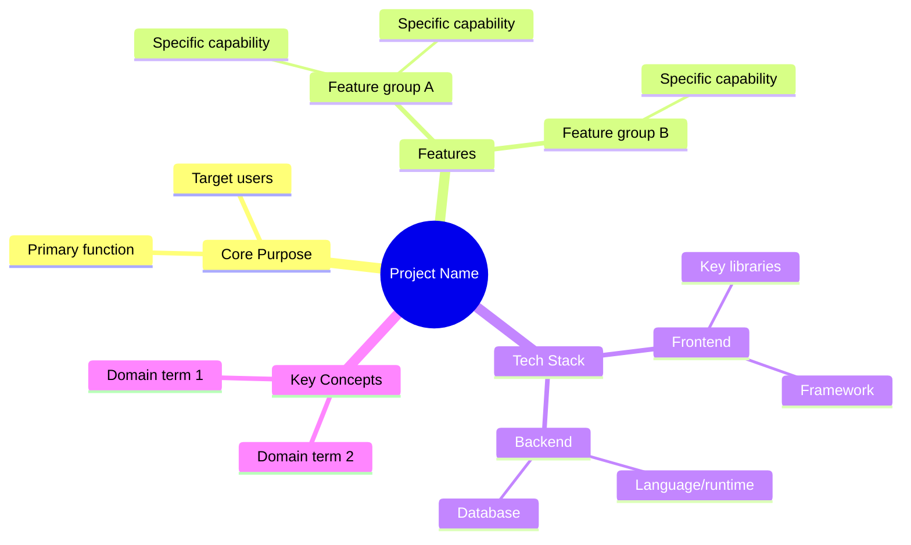
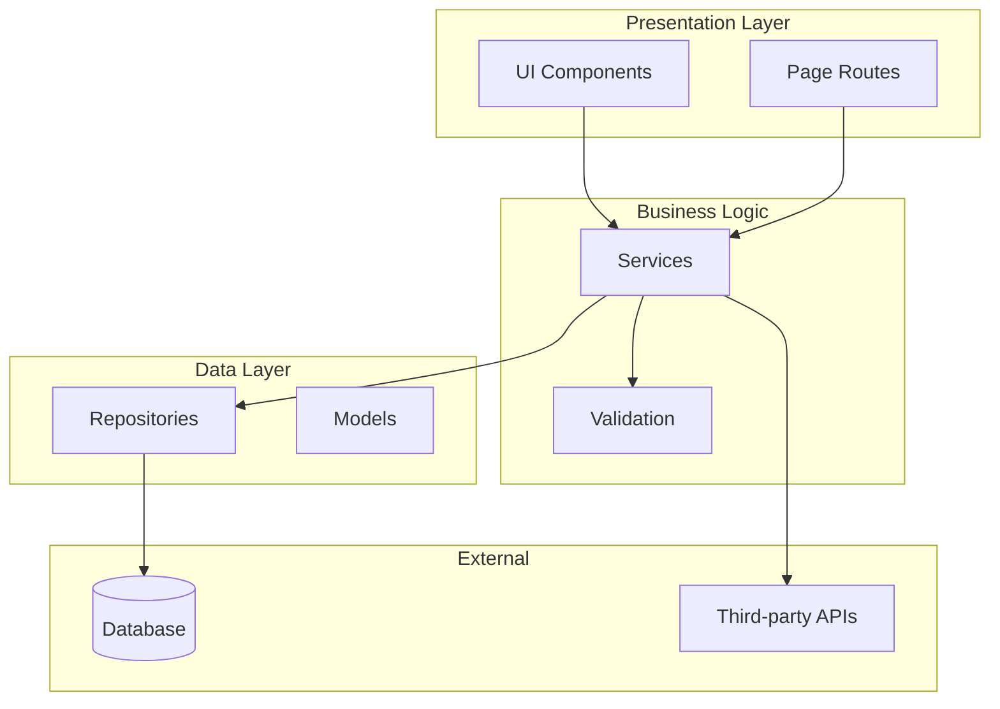
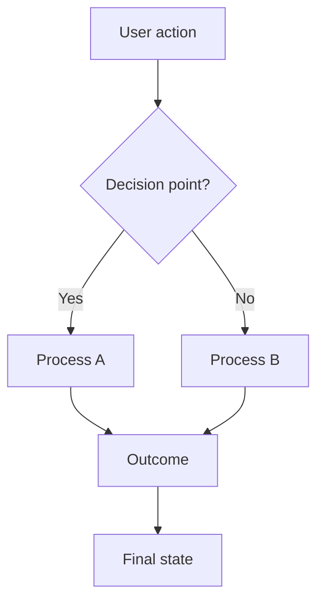
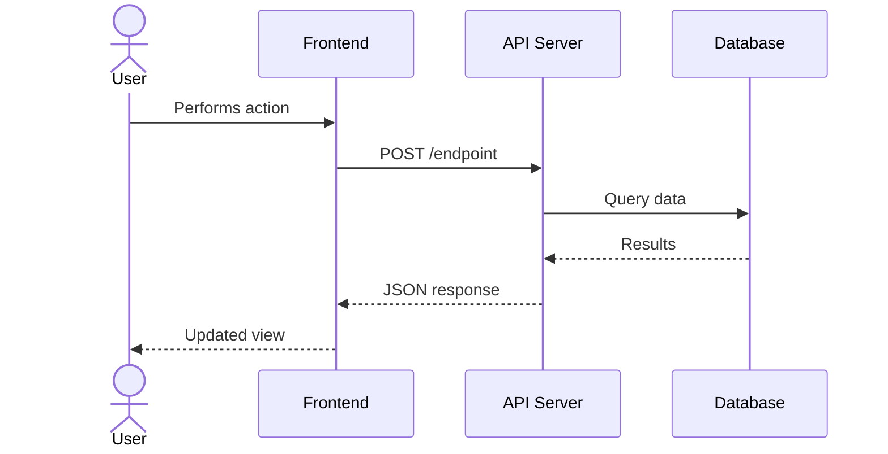
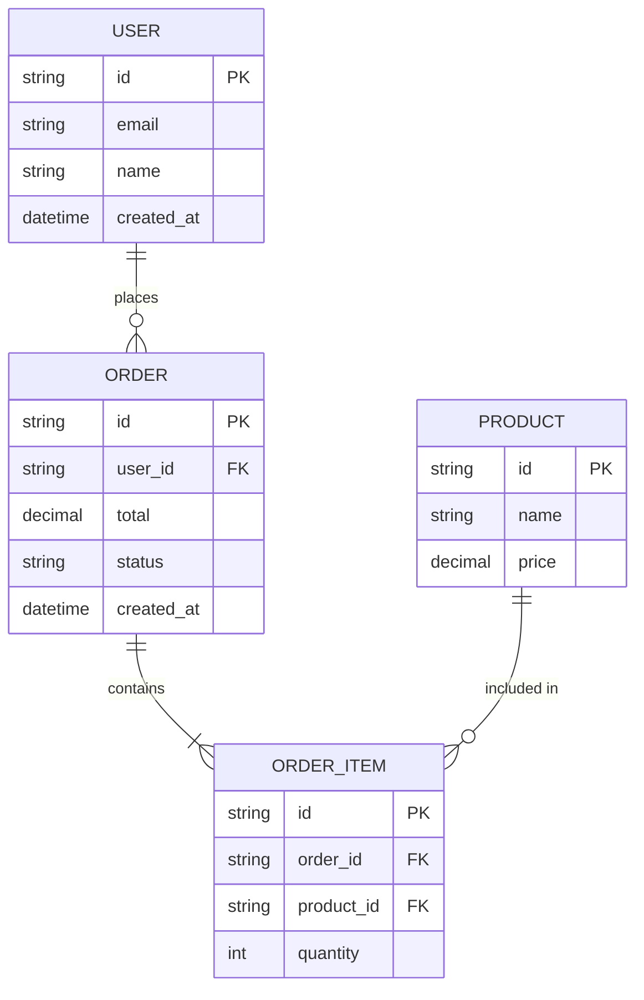

# Mermaid Diagram Patterns

Reference templates for diagrams used in codebase-mapper output documents.

## 1. Mindmap (01-overview.md)

Project concept map showing high-level structure and relationships.

### Guidelines
- Root node: project name in double parentheses `(( ))`
- Max 3 levels deep
- Group by functional areas, not file structure
- Use plain language, not technical identifiers

## 2. Component/Layer Diagram (04-architecture.md)

Shows how the codebase is organized into layers or modules.

### Guidelines
- Use subgraphs for layers/boundaries
- Label subgraphs with human-readable names
- Show data flow direction with arrows
- Use shape conventions: `[Rectangle]` for components, `[(Cylinder)]` for databases, `([Stadium])` for external services
- Include file path annotations as comments where helpful

## 3. Flowchart (05-workflows.md)

User or system workflows showing decision points and outcomes.

### Guidelines
- Start with the trigger (user action or system event)
- Use `{ }` for decision diamonds
- Label all edges, especially from decision nodes
- Keep linear - avoid complex crossing lines
- One workflow per diagram - split complex flows into multiple diagrams

## 4. Sequence Diagram (05-workflows.md)

Interactions between components over time for key operations.

### Guidelines
- Name participants with readable aliases: `participant API as API Server`
- Use `actor` for human users
- Solid arrows `->>`  for requests, dashed `-->>` for responses
- Add `Note over` for important context
- Keep to 5-8 interactions per diagram - split if longer
- Show the happy path first, mention error paths in text

## 5. ER Diagram (06-data-model.md)

Entity relationships showing data structures and their connections.

### Guidelines
- Include PK/FK annotations
- Use standard cardinality notation: `||--o{` (one-to-many), `||--||` (one-to-one), `}o--o{` (many-to-many)
- Label relationships with verbs
- Include key fields only - not every column
- Group related entities visually

## General Rules

- Keep diagrams under 15-20 nodes
- Use consistent naming across all diagrams in a guide
- Test that syntax renders correctly in standard Mermaid renderers
- Prefer clarity over completeness - a readable subset beats a cluttered whole
- Add a brief text introduction before each diagram explaining what it shows
